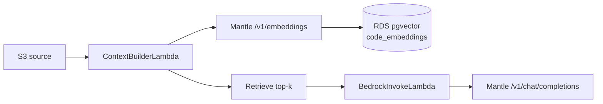

---
title: "Bedrock Mantle"
date: 2024-01-01
weight: 5
chapter: false
pre: " <b> 5.4.5. </b> "
---

#### Step 1 — Enable Model access (Mantle region)

1. Console → **Amazon Bedrock** → switch region to **`us-east-1` (N. Virginia)** *(Mantle endpoint region)*.
2. **Model access** (or **Model catalog**) → enable access for **both** models:
   - **`openai.gpt-oss-120b`** — Unit Test generation (Chat Completions)
   - **`cohere.embed-multilingual-v3`** — **required** for RAG pipeline (Embeddings)
3. Wait for **Access granted** status for each model.

{}
The workshop deploys VPC/Lambda in **`ap-southeast-1`**, but calls inference via **`bedrock-mantle.us-east-1.api.aws`** — **cross-region**. Record this clearly in the [parameter table](../../5.2-prerequisites/5.2.3-parameter-table/).
{}

#### Step 2 — Handoff parameters for Hoa

| Parameter | Value |
| --- | --- |
| Mantle base URL | `https://bedrock-mantle.us-east-1.api.aws` |
| Chat Completions path | `/v1/chat/completions` |
| Embeddings path | `/v1/embeddings` |
| Model ID (chat) | `openai.gpt-oss-120b` |
| Model ID (embedding) | `cohere.embed-multilingual-v3` |
| Embedding dimension | `1024` *(Cohere multilingual v3)* |
| Mantle region | `us-east-1` |
| Lambda region | `ap-southeast-1` |
| Vector table (RDS) | `code_embeddings` *(pgvector — see [5.4.4](../5.4.4-schema-jpa/))* |
| RAG top-k | `5` *(workshop suggestion)* |

#### Step 3 — Lightweight RAG (option A — workshop)

The AI pipeline uses a single **Context Builder Lambda** (`ContextBuilderLambda`) for all vector steps — **no** separate embedding Lambda, **no** OpenSearch.



| Step | Who / where | Task |
| --- | --- | --- |
| 1 | **Kiệt** | Enable chat + embedding models; prepare **pgvector** extension and `code_embeddings` table on RDS ([5.4.4](../5.4.4-schema-jpa/)) |
| 2 | **Hoa** — `ContextBuilderLambda` | Read source file from S3 → chunk text |
| 3 | Same Lambda | Call **`POST /v1/embeddings`**, model `cohere.embed-multilingual-v3`, Bearer API key |
| 4 | Same Lambda | Store vector in **`code_embeddings`** (column `embedding vector(1024)`) |
| 5 | Same Lambda | Query **top-k** related chunks by `project_id` *(cosine / `<=>` pgvector)* |
| 6 | **Hoa** — `BedrockInvokeLambda` | Receive `context` from Step Functions → **`POST /v1/chat/completions`** → generate Unit Test |

{}
**Kiệt** does not deploy Lambda — only enables models and **vector infrastructure on RDS**. **Hoa** configures API key + Lambda code per [5.6.3](../../5.6-TV4-serverless/5.6.3-ai-invoke-bedrock-mantle/) *(Lambda deployment details are in section 5.6)*.
{}

**Sample embedding payload:**

```json
{
  "model": "cohere.embed-multilingual-v3",
  "input": ["code snippet or comment to embed"],
  "input_type": "search_document"
}
```

When retrieving, use `input_type: "search_query"` for the question / summary prompt. Query vector matches stored chunks (`search_document`).

#### Hoa deployment (section 5.6)

| Lambda | Role |
| --- | --- |
| **`ContextBuilderLambda`** | Embed + store pgvector + retrieve → return `context` |
| **`BedrockInvokeLambda`** | Chat Completions with `context` + source |

Both Lambdas:

- Header `Authorization: Bearer <BEDROCK_MANTLE_API_KEY>` — key created from Bedrock Console → **API keys** (TTL ~30 days), configured as **Environment variable** on Lambda.
- Run in **VPC private subnet** → reach internet via **NAT Gateway** (Trí) to reach `us-east-1`.

→ Deploy details for **`BedrockInvokeLambda`**: [Lambda — AI Invoke (Bedrock Mantle)](../../5.6-TV4-serverless/5.6.3-ai-invoke-bedrock-mantle/).

<!-- Image: /images/5-Workshop/5.4/bedrock-model-access.png — Bedrock Console, region us-east-1, Model access -->
