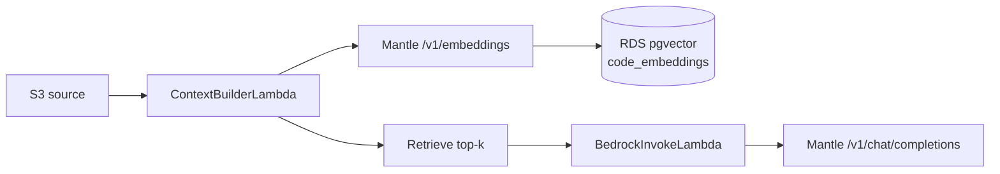

---
title: "Bedrock Mantle"
date: 2024-01-01
weight: 5
chapter: false
pre: " <b> 5.4.5. </b> "
---

#### Bước 1 — Bật Model access (region Mantle)

1. Console → **Amazon Bedrock** → đổi region **`us-east-1` (N. Virginia)** *(region endpoint Mantle)*.
2. **Model access** (hoặc **Model catalog**) → bật quyền cho **cả hai** model:
   - **`openai.gpt-oss-120b`** — sinh mã Unit Test (Chat Completions)
   - **`cohere.embed-multilingual-v3`** — **bắt buộc** cho pipeline RAG (Embeddings)
3. Đợi trạng thái **Access granted** cho từng model.

{}
Workshop triển khai VPC/Lambda ở **`ap-southeast-1`**, nhưng gọi inference qua **`bedrock-mantle.us-east-1.api.aws`** — **cross-region**. Ghi rõ trên [bảng tham số](../../5.2-prerequisites/5.2.3-parameter-table/).
{}

#### Bước 2 — Ghi tham số bàn giao Hoa

| Tham số | Giá trị |
| --- | --- |
| Mantle base URL | `https://bedrock-mantle.us-east-1.api.aws` |
| Chat Completions path | `/v1/chat/completions` |
| Embeddings path | `/v1/embeddings` |
| Model ID (chat) | `openai.gpt-oss-120b` |
| Model ID (embedding) | `cohere.embed-multilingual-v3` |
| Embedding dimension | `1024` *(Cohere multilingual v3)* |
| Mantle region | `us-east-1` |
| Lambda region | `ap-southeast-1` |
| Vector table (RDS) | `code_embeddings` *(pgvector — xem [5.4.4](../5.4.4-schema-jpa/))* |
| RAG top-k | `5` *(gợi ý workshop)* |

#### Bước 3 — RAG gọn (phương án A — workshop)

Pipeline AI dùng **một Lambda Context Builder** (`ContextBuilderLambda`) làm toàn bộ bước vector — **không** tách Lambda embedding riêng, **không** OpenSearch.



| Bước | Ai / đâu | Việc |
| --- | --- | --- |
| 1 | **Kiệt** | Bật model chat + embedding; chuẩn bị extension **pgvector** và bảng `code_embeddings` trên RDS ([5.4.4](../5.4.4-schema-jpa/)) |
| 2 | **Hoa** — `ContextBuilderLambda` | Đọc file source từ S3 → chunk văn bản |
| 3 | Cùng Lambda | Gọi **`POST /v1/embeddings`**, model `cohere.embed-multilingual-v3`, Bearer API key |
| 4 | Cùng Lambda | Lưu vector vào **`code_embeddings`** (cột `embedding vector(1024)`) |
| 5 | Cùng Lambda | Truy vấn **top-k** chunk liên quan `project_id` *(cosine / `<=>` pgvector)* |
| 6 | **Hoa** — `BedrockInvokeLambda` | Nhận `context` từ Step Functions → **`POST /v1/chat/completions`** → sinh Unit Test |

{}
**Kiệt** không triển khai Lambda — chỉ bật model và **hạ tầng vector trên RDS**. **Hoa** cấu hình API key + code Lambda theo [5.6.3](../../5.6-TV4-serverless/5.6.3-ai-invoke-bedrock-mantle/) *(chi tiết triển khai Lambda nằm ở mục 5.6)*.
{}

**Payload embedding (gợi ý):**

```json
{
  "model": "cohere.embed-multilingual-v3",
  "input": ["đoạn code hoặc comment cần embed"],
  "input_type": "search_document"
}
```

Khi retrieve, dùng `input_type: "search_query"` cho câu hỏi / prompt tóm tắt. Vector truy vấn so khớp với chunk đã lưu (`search_document`).

#### Hoa triển khai (mục 5.6)

| Lambda | Vai trò |
| --- | --- |
| **`ContextBuilderLambda`** | Embed + lưu pgvector + retrieve → trả `context` |
| **`BedrockInvokeLambda`** | Chat Completions với `context` + source |

Cả hai Lambda:

- Header `Authorization: Bearer <BEDROCK_MANTLE_API_KEY>` — key tạo từ Bedrock Console → **API keys** (TTL ~30 ngày), cấu hình **Environment variable** trên Lambda.
- Chạy **VPC private subnet** → ra internet qua **NAT Gateway** (Trí) để tới `us-east-1`.

→ Chi tiết deploy **`BedrockInvokeLambda`**: [Lambda — AI Invoke (Bedrock Mantle)](../../5.6-TV4-serverless/5.6.3-ai-invoke-bedrock-mantle/).

<!-- Hình: /images/5-Workshop/5.4/bedrock-model-access.png — Bedrock Console, region us-east-1, Model access -->
